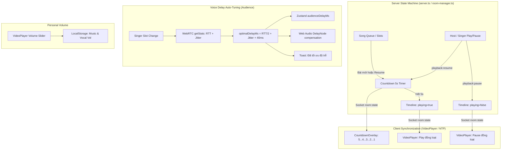

# Kế hoạch Triển khai: Đồng bộ Play/Pause, Đếm ngược 5s, Tự tính Delay Voice & Chỉnh âm lượng cá nhân

> **For agentic workers:** REQUIRED SUB-SKILL: Use superpowers:subagent-driven-development to implement this plan task-by-task. Steps use checkbox (`- [ ]`) syntax for tracking.

**Goal:** Triển khai cơ chế đồng bộ Play/Pause theo máy chủ (Host & Ca sĩ), đếm ngược 5 giây trước khi bắt đầu bài mới hoặc tiếp tục phát, tự động đo và tối ưu độ trễ giọng (WebRTC delay) khi đổi chỗ ca sĩ, và bổ sung thanh chỉnh âm lượng cá nhân trên VideoPlayer và Sân khấu.

**Architecture:**
- **Server-Authoritative Playback**: Quản lý `playing`, `positionSec`, và `countdown` tập trung tại `Timeline` trên máy chủ.
- **5s Countdown State Machine**: Khi bắt đầu bài hoặc resume, máy chủ tạo countdown 5s, hẹn giờ 5000ms rồi mới chuyển `playing: true`. Phía client hiển thị overlay hoạt ảnh đếm ngược đồng bộ NTP.
- **Dynamic Voice Delay Calculator**: Phía Khán giả theo dõi thay đổi của `singerSlots`, đo WebRTC RTT + Jitter tới ca sĩ đang hát, tự động cập nhật `audienceDelayMs` cho VideoPlayer và `DelayNode` của Web Audio.
- **Personal Audio Controls**: Thanh trượt âm lượng nhạc trực tiếp trên VideoPlayer và âm lượng giọng trên Sân khấu, lưu cục bộ `localStorage`.

**Architecture Diagram:**



**Tech Stack:** Next.js 15, React 19, Socket.IO, WebRTC, Web Audio API, Zustand, Tailwind CSS, Lucide React, Vitest.

**Spec:** [docs/superpowers/specs/2026-10-05-sync-countdown-delay-volume-design.md](file:///d:/Downloads/kararoom/docs/superpowers/specs/2026-10-05-sync-countdown-delay-volume-design.md)

## Global Constraints
- Single source of truth cho dữ liệu phòng là Server `RoomState`.
- Không làm gián đoạn các test case hiện có trong `tests/room-logic.test.ts` và `tests/sync.test.ts`.
- Countdown đếm ngược 5 giây phải đồng bộ theo đồng hồ NTP server giữa các client, không dựa vào `setInterval` cục bộ lệch pha.
- Âm lượng là trải nghiệm cá nhân: TUYỆT ĐỐI KHÔNG broadcast mức âm lượng lên server.

---

### Task 1: Định nghĩa Types và Socket Events

**Files:**
- Modify: [shared/types.ts](file:///d:/Downloads/kararoom/shared/types.ts)
- Modify: [shared/events.ts](file:///d:/Downloads/kararoom/shared/events.ts)
- Test: [tests/room-logic.test.ts](file:///d:/Downloads/kararoom/tests/room-logic.test.ts)

**Interfaces:**
- `CountdownState`: `{ active: boolean; startAtServerMs: number; durationSec: number; type: "start" | "resume" }`
- Bổ sung `countdown?: CountdownState | null` vào `Timeline`.
- Bổ sung `PLAYBACK_PAUSE: "playback:pause"` và `PLAYBACK_RESUME: "playback:resume"` vào `SOCKET_EVENTS`.
- Bổ sung `PlaybackControlPayloadSchema`.

- [ ] **Step 1: Viết failing test kiểm tra kiểu dữ liệu và schema cho playback controls**

Thêm test vào `tests/room-logic.test.ts`:
```ts
it("xác thực schema sự kiện playback control", () => {
  const valid = PlaybackControlPayloadSchema.safeParse({});
  expect(valid.success).toBe(true);
});
```

- [ ] **Step 2: Chạy test để xác nhận test fail**
Run: `pnpm test`
Expected: FAIL vì `PlaybackControlPayloadSchema` chưa được khai báo.

- [ ] **Step 3: Cập nhật `shared/types.ts` và `shared/events.ts`**
Cập nhật `CountdownState`, `Timeline` và `PlaybackControlPayloadSchema` trong `shared/types.ts`.
Thêm `PLAYBACK_PAUSE`, `PLAYBACK_RESUME` vào `shared/events.ts`.

- [ ] **Step 4: Chạy lại test để xác nhận pass**
Run: `pnpm test`
Expected: PASS.

---

### Task 2: Logic Server Play/Pause và Countdown 5s

**Files:**
- Modify: [server/song-logic.ts](file:///d:/Downloads/kararoom/server/song-logic.ts)
- Modify: [server/room-manager.ts](file:///d:/Downloads/kararoom/server/room-manager.ts)
- Modify: [server/socket-handlers.ts](file:///d:/Downloads/kararoom/server/socket-handlers.ts)
- Test: [tests/room-logic.test.ts](file:///d:/Downloads/kararoom/tests/room-logic.test.ts)

**Interfaces:**
- `pausePlayback(state: RoomState, requesterUserId: string, nowMs?: number): { state: RoomState; error?: string }`
- `resumePlayback(state: RoomState, requesterUserId: string, nowMs?: number): { state: RoomState; error?: string }`
- `startSongWithCountdown(state: RoomState, song: SongItem, nowMs?: number): RoomState`

- [ ] **Step 1: Viết failing test cho `pausePlayback` và `resumePlayback`**
Trong `tests/room-logic.test.ts`:
- Test Pause: Người gửi là Host hoặc Singer được phép dừng bài, `timeline.playing === false`, `positionSec` được tính chính xác dựa vào thời gian trôi qua.
- Test Pause Permission: Người gửi là Khán giả bình thường bị từ chối với lỗi `Chỉ trưởng phòng hoặc ca sĩ mới có quyền tạm dừng.`.
- Test Resume: Trạng thái chuyển sang `countdown.active === true`, `countdown.durationSec === 5`.

- [ ] **Step 2: Chạy test để xác nhận fail**
Run: `pnpm test`

- [ ] **Step 3: Hiện thực các hàm trong `server/song-logic.ts`**
- `pausePlayback`: kiểm tra quyền, tính `elapsedSec`, set `positionSec`, `playing = false`, `countdown = null`.
- `resumePlayback`: kiểm tra quyền, set `countdown = { active: true, startAtServerMs: nowMs, durationSec: 5, type: "resume" }`, `playing = false`.
- Cập nhật `addSong` và `playNextSongImmediately`: Khi phát bài mới, thiết lập `countdown = { active: true, startAtServerMs: nowMs, durationSec: 5, type: "start" }`, `playing = false`.

- [ ] **Step 4: Quản lý Timer Countdown trong `server/room-manager.ts` & `socket-handlers.ts`**
- Thêm `countdownTimers: Map<string, NodeJS.Timeout>` trong `RoomManager`.
- Khi kích hoạt countdown, tạo timer 5s. Khi hết 5s, gọi `finishCountdown(roomCode)` để set `playing = true`, `countdown = null`, `serverTimeMs = Date.now()` và broadcast `room:state`.
- Khi pause: hủy timer countdown nếu đang chạy.
- Đăng ký socket handler cho `SOCKET_EVENTS.PLAYBACK_PAUSE` và `SOCKET_EVENTS.PLAYBACK_RESUME`.

- [ ] **Step 5: Chạy test để xác nhận pass toàn bộ**
Run: `pnpm test`
Expected: Tất cả test logic phòng và đồng bộ đều pass.

---

### Task 3: VideoPlayer với Play/Pause Sync, 5s Countdown Overlay & Quick Volume

**Files:**
- Modify: [components/room/VideoPlayer.tsx](file:///d:/Downloads/kararoom/components/room/VideoPlayer.tsx)
- Create: [components/room/CountdownOverlay.tsx](file:///d:/Downloads/kararoom/components/room/CountdownOverlay.tsx)
- Modify: [lib/sync/timeline.ts](file:///d:/Downloads/kararoom/lib/sync/timeline.ts)

**Interfaces:**
- `CountdownOverlayProps`: `{ countdown: CountdownState | null; songTitle?: string }`
- `VideoPlayerProps`: Bổ sung `canControlPlayback: boolean`, `onTogglePlayPause: () => void`, `onUpdateVolume: (vol: number) => void`.

- [ ] **Step 1: Tạo component `CountdownOverlay.tsx`**
- Hiển thị hiệu ứng đếm ngược 5 giây cực đẹp với vòng tròn pulse, số đếm to sắc nét (5, 4, 3, 2, 1, "BẮT ĐẦU! 🎤").
- Tính số giây còn lại theo `getClockSync().nowServerTime() - countdown.startAtServerMs`.
- Nhạc nền countdown hoặc hiệu ứng visual đếm nhịp rộn ràng.

- [ ] **Step 2: Cập nhật `VideoPlayer.tsx`**
- Nhúng `CountdownOverlay` khi `timeline?.countdown?.active`.
- Nút Play/Pause trên thanh điều khiển gọi `onTogglePlayPause`. Nếu không có quyền (`!canControlPlayback`), nút mờ đi với tooltip thông báo "Chỉ Host hoặc Ca sĩ mới có quyền điều khiển".
- Đồng bộ hiệu ứng native video `video.pause()` / `video.play()` khi `timeline.playing` thay đổi.
- Bổ sung thanh trượt âm lượng (Volume Slider) dạng popup/inline ngay cạnh icon Loa:
  - Cho phép kéo từ 0% đến 100%.
  - Gọi `onUpdateVolume` để lưu store và áp dụng vào `videoRef.current.volume`.

- [ ] **Step 3: Kiểm tra biên dịch**
Run: `pnpm build`

---

### Task 4: Tự động đo và tối ưu Delay Voice khi đổi ca sĩ

**Files:**
- Modify: [lib/rtc/transport.ts](file:///d:/Downloads/kararoom/lib/rtc/transport.ts)
- Modify: [app/page.tsx](file:///d:/Downloads/kararoom/app/page.tsx)
- Modify: [components/room/SingingStage.tsx](file:///d:/Downloads/kararoom/components/room/SingingStage.tsx)

**Interfaces:**
- `P2PVoiceTransport.getPeerLatency(userId: string): PeerLatencyStats | null`
- Tự động phát hiện thay đổi ca sĩ trong `useEffect` của `app/page.tsx`.
- Thêm thanh trượt nhanh âm lượng giọng hát (Vocal Volume) trên `SingingStage.tsx`.

- [ ] **Step 1: Bổ sung helper lấy độ trễ tới ca sĩ cụ thể trong `lib/rtc/transport.ts`**
Thêm phương thức `getPeerStats(userId: string)` trả về `PeerLatencyStats` chứa RTT, Jitter và Estimated Latency.

- [ ] **Step 2: Hiện thực cơ chế tự tính & đề xuất delay trong `app/page.tsx`**
- Dùng `useRef` lưu `previousSingerIds`.
- Khi `singerSlots` thay đổi và người dùng hiện tại là Khán giả:
  - Nếu có ít nhất 1 ca sĩ đang online:
    - Đợi 1000ms để WebRTC peer connection ổn định nếu là ca sĩ mới.
    - Lấy stats tới ca sĩ chính.
    - Tính toán:
      `optimalDelayMs = Math.max(200, Math.min(1000, Math.round(stats.estimatedLatencyMs + 40)))`
    - Cập nhật `store.setAudienceDelayMs(optimalDelayMs)`.
    - Gọi `voiceTransportRef.current.updateAudienceDelay(optimalDelayMs)`.
    - Kích hoạt Toast thông báo:
      `toast: "🎧 Đã tự động căn độ trễ ${optimalDelayMs}ms theo ca sĩ để khớp nhạc chuẩn xác!"`

- [ ] **Step 3: Bổ sung thanh trượt âm lượng giọng nhanh trong `SingingStage.tsx`**
- Thêm slider điều chỉnh âm lượng giọng hát phòng (0% - 150%) cạnh nút mic/monitor để người nghe dễ dàng vặn to/nhỏ giọng ca sĩ mà không cần mở drawer.

- [ ] **Step 4: Kiểm tra biên dịch**
Run: `pnpm build`

---

### Task 5: Kiểm tra toàn diện & Nghiệm thu (Verification)

- [ ] **Step 1: Chạy toàn bộ unit tests**
Run: `pnpm test`
Expected: Toàn bộ test pass 100%.

- [ ] **Step 2: Chạy kiểm tra lint**
Run: `pnpm lint`

- [ ] **Step 3: Chạy build production**
Run: `pnpm build`
Expected: Next.js build thành công không lỗi type hay lint.

- [ ] **Step 4: Xác thực trực tiếp trên trình duyệt hoặc máy chủ dev**
Chạy `pnpm dev`, mở trang chủ, kiểm tra Play/Pause, Countdown 5s, Volume Slider và Voice Delay.
